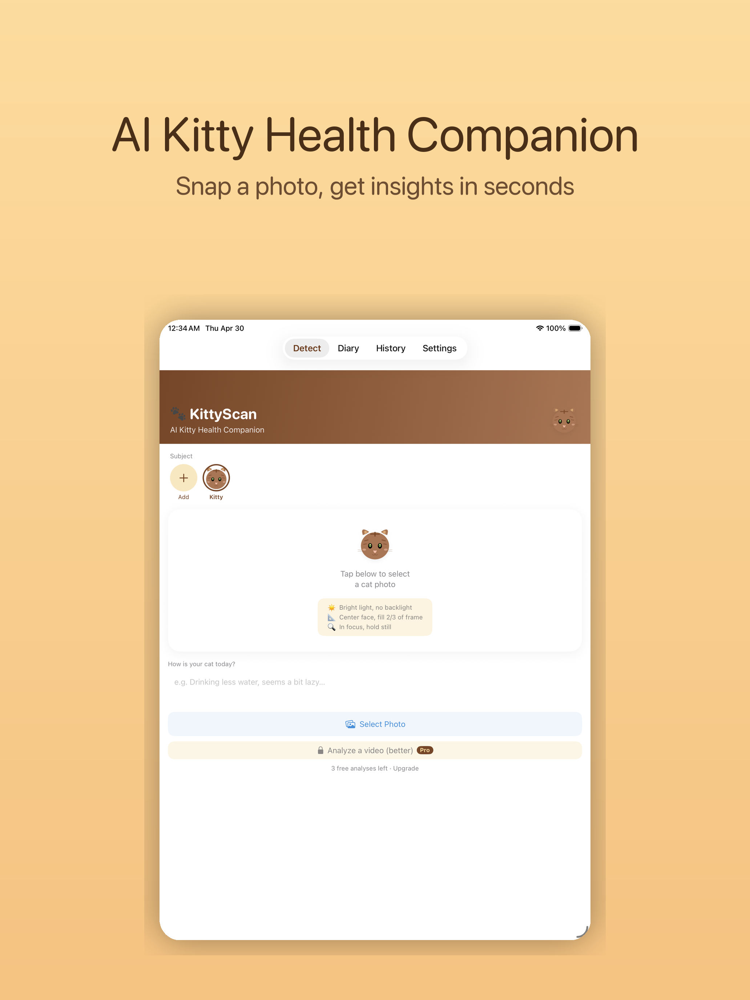
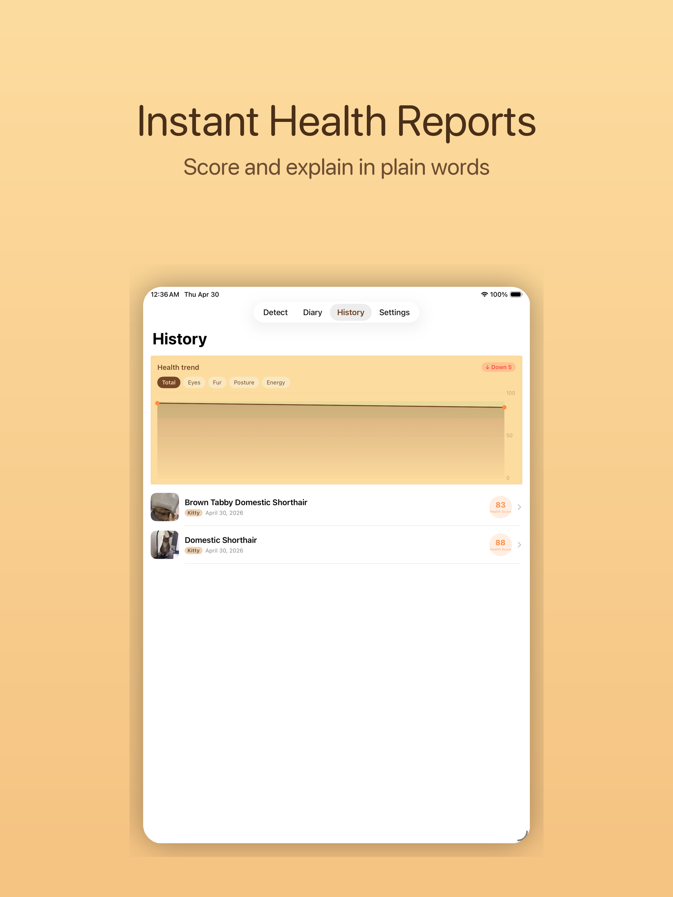
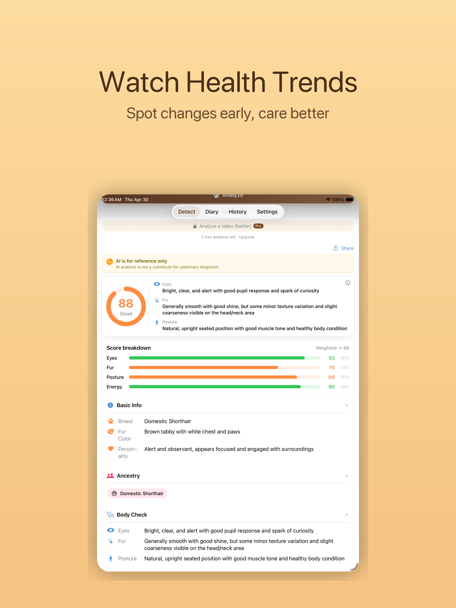
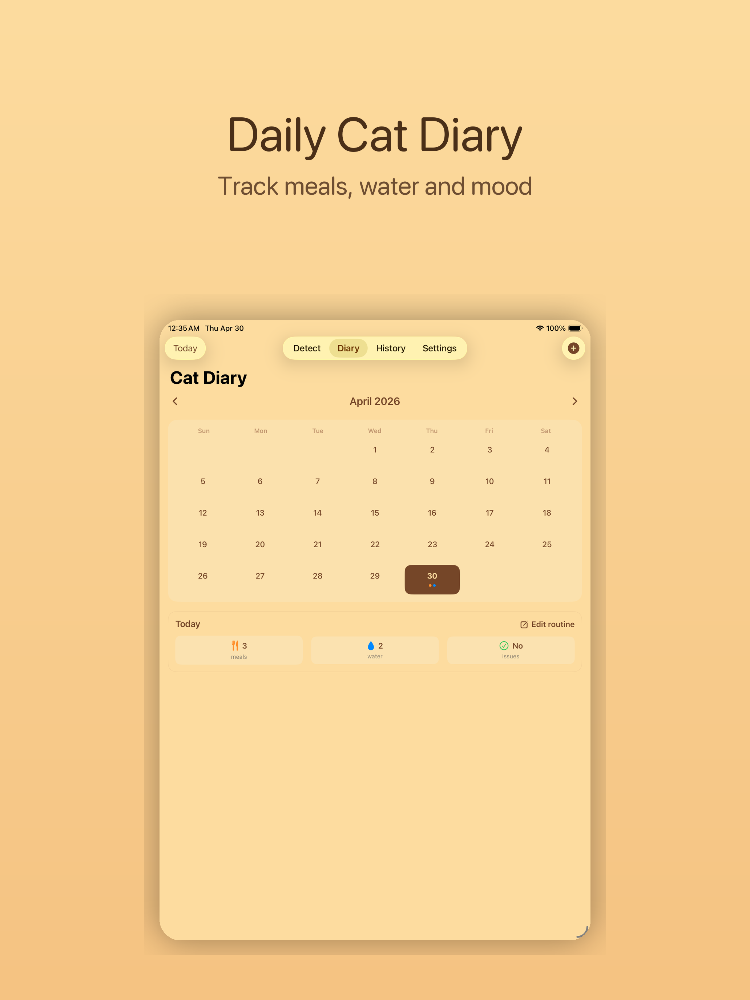
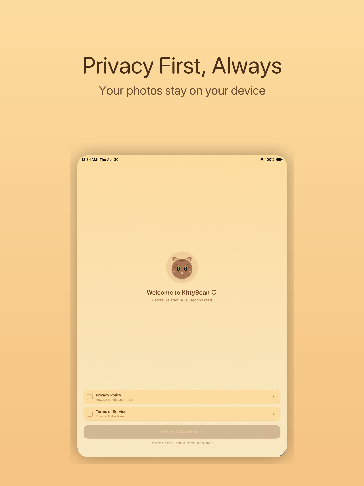
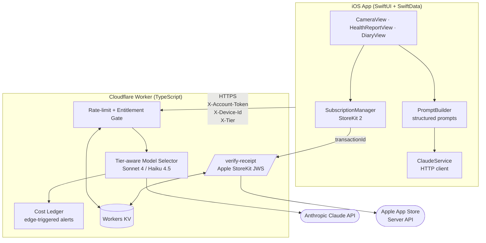

# 🐾 KittyScan — AI Cat Health Companion

[](https://swift.org)
[](https://developer.apple.com/swiftui/)
[](https://anthropic.com)
[](#)
[](LICENSE)

> SwiftUI iOS app that turns a single cat photo into a vet-aware health
> report in ~5 seconds, powered by Claude vision. Includes diary tracking,
> trend analysis, AI follow-up chat, and a privacy-first on-device data
> model. Backed by a [TypeScript Cloudflare Worker](https://github.com/KittyScan/Kitty-Scan-Worker)
> that brokers all Anthropic calls and verifies Apple StoreKit purchases
> server-side.

---

## Screenshots

<p align="center">
  
  
  
  
  
</p>

---

## Features

- **One-tap analysis** — pick a cat photo, get a structured health report
  (eyes, fur, posture, energy, score, care tips) in plain language.
- **Daily diary** — log meals, water, mood. The last 7 days fold into the
  next analysis prompt so the AI sees context, not just the photo.
- **Trend tracking** — per-axis health charts surface drifts before they
  become problems.
- **Chat with the AI** — Pro users can ask follow-up questions; the model
  carries the cat's full history into every reply.
- **30 languages** — model output language follows the user's choice.
- **Privacy-first** — photos are processed during the API call only, never
  persisted on our servers. All cat profiles and reports live locally on
  the device via SwiftData.

---

## Architecture



The iOS client never holds an API key — every Anthropic request is
brokered by the Worker, which enforces per-device rate limits, validates
Apple StoreKit purchases via JWS, and writes a tier-aware entitlement
ledger to Cloudflare KV.

---

## Tech Stack

| Layer | Technology |
|---|---|
| **iOS** | Swift 6, SwiftUI, SwiftData, StoreKit 2, AuthenticationServices, AVFoundation |
| **AI** | Claude Sonnet 4 (Pro) / Haiku 4.5 (Free + pack) |
| **Backend** | Cloudflare Workers, Workers KV, TypeScript |
| **Auth** | Sign in with Apple, Google Sign-In, anonymous skip flow |
| **Payments** | Apple StoreKit 2 + App Store Server API (JWS verification) |
| **Identity** | NSUbiquitousKeyValueStore (cross-reinstall stable user ID) |

---

## What's interesting in here

### Multi-model AI orchestration with cost-per-request awareness
The backend selects between Claude Sonnet 4 (accuracy) and Haiku 4.5 (~6×
cheaper) based on the user's *server-verified* tier, not the client-claimed
tier. Tier signal comes from a JWS-validated Apple StoreKit transaction —
a jailbroken client setting `X-Tier: premium` still gets whatever the
entitlement ledger proves they paid for.

### Production-grade prompt engineering pipeline
[`PromptBuilder.swift`](CatHealthApp/PromptBuilder.swift) composes a
structured prompt that folds in the cat's profile, the last 7 days of
diary entries, and a strict JSON output schema so the iOS UI can parse
responses deterministically. Excerpt:

```swift
return """
This is check #\(checkNum) for \(cat.name).
\(cat.name) is a \(breedLine) cat, \(neuterStr)\(issues).
\(personality)
Check history (for trend comparison only — do NOT anchor this check's
score to past scores):
\(historyLines.isEmpty ? "(First check — no history yet)" : historyLines)
\(diary)

Owner's note today: \(note)

Please analyze this photo using the context above. In your analysis:
- Compare with the last check and explicitly state: improved/worsened/stable
- If an issue has appeared 2+ times in a row, emphasize it
- If a previously flagged issue has improved, explicitly praise the progress

[STRUCTURED SCORING — STRICT]
Do NOT give a single overall score — grade FOUR dimensions independently
on 0-100. Code computes the composite from weights.
"""
```

The 7-day diary block is omitted entirely when empty — no "no data" line —
because absence already implies absence and saves tokens.

### Defense-in-depth against AI-cost abuse
Three orthogonal layers (per-IP / per-device / per-account-token)
backstop a hard $20/mo Anthropic spend cap so a single jailbroken client
cannot drain the budget. See the [Worker repo](https://github.com/KittyScan/Kitty-Scan-Worker)
for the rate-limit + ledger code.

### Stable user identity via NSUbiquitousKeyValueStore
Closes the "delete app to reset free trial" loophole without forcing
sign-in, preserving the friction-free skip-onboarding flow. The Account
Token UUID is read from iCloud → UserDefaults → freshly-generated, in
that order, then mirrored both directions.

### End-to-end privacy
No third-party analytics SDKs, no IDFA, no ATT prompt; cat photos pass
through during the API call only and are never persisted on the backend.

---

## Project Structure

```
CatHealthApp/
├── CatHealthAppApp.swift          # App entry, root navigation
├── ContentView.swift              # Root tab view
├── CameraView.swift               # Capture + analyze flow
├── HealthReportView.swift         # Generated report UI
├── HealthChartView.swift          # Per-axis trend charts
├── DiaryView.swift                # Daily log calendar
├── HistoryView.swift              # Past analyses
├── PaywallView.swift              # IAP + subscription UI
├── SubscriptionManager.swift      # StoreKit 2 + entitlement
├── ClaudeService.swift            # Backend API client
├── PromptBuilder.swift            # Structured prompt construction
├── ThemeProvider.swift            # 22 cat-themed palettes
├── ConsentGate.swift              # Privacy-aware first run
├── Policies.swift                 # In-app privacy / terms
└── ...                            # ~50 more source files
```

---

## Related

- **Backend**: <https://github.com/KittyScan/Kitty-Scan-Worker> — the
  Cloudflare Worker that brokers Claude calls, verifies Apple StoreKit
  JWS, and runs the entitlement ledger.
- v1.0 currently in App Store review.
- Backend secrets (Anthropic key, Apple .p8) are stored as Cloudflare
  Worker secrets, never committed.

## License

[Source-available for portfolio review.](LICENSE)
